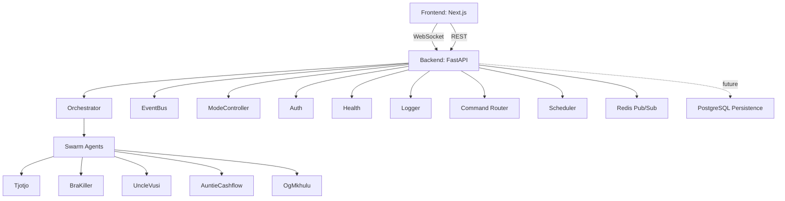

# Phoenix Swarm-OS

> *From the heart of Tshwane to the edge of the cloud.*

**Autonomous multi-agent SaaS factory** — built in Pretoria, hardened for the world.

---

## Backstory

Howzit. We didn't build this in a glass tower in Sandton. We built it in the kasi — between load-shedding schedules, lekker coffee, and the kind of quiet hustle that only Tshwane knows. We built it because ambition shouldn't be limited by your postcode.

Phoenix Swarm-OS is a containerized, production-ready foundation for orchestrating specialised AI agents that design, analyse, and monetise software products. It's for the boets and sistas who want to run a SaaS factory from Mamelodi, Atteridgeville, Soshanguve, Centurion, or anywhere else in Mzansi — and compete globally while doing it.

Let the ambition run freely. Stay with it on its journey. Harness the full potential and capabilities. Shatter every mirror that says otherwise.

We didn't wait for permission. Neither should you.

---

## Architecture



- **Frontend**: Next.js dashboard with live WebSocket updates. Clean, fast, and built for real-time visibility.
- **Backend**: FastAPI service exposing REST + WebSocket, with modular core (auth, event bus, orchestrator, mode controller, scheduler). Every piece does one job and does it well.
- **Agents**: Five specialised agents — codenames with real skills — handling product, competitor, backend, revenue, and integration analysis. Think of them as your remote team that never sleeps and never complains.
- **Infrastructure**: Redis for pub/sub. PostgreSQL is planned but not yet implemented — all state is currently in-memory. Don't expect persistence until we ship it. We'll tell you when we do.

---

## Modes

| Mode        | Behavior                                                                 |
|-------------|--------------------------------------------------------------------------|
| **MANUAL**  | Every swarm action requires an explicit user command. (Default)          |
| **AUTONOMOUS** | System executes the full pipeline without confirmation. Use with caution. |

**Toggle mode:**

```bash
curl -X POST http://localhost:8000/command \
  -H "Authorization: Bearer $AUTH_TOKEN" \
  -H "Content-Type: application/json" \
  -d '{"action": "set_mode", "mode": "AUTONOMOUS"}'
```

**Query current mode:**

```bash
curl -X POST http://localhost:8000/command \
  -H "Authorization: Bearer $AUTH_TOKEN" \
  -H "Content-Type: application/json" \
  -d '{"action": "status"}'
```

> **Safety note**: In AUTONOMOUS mode, agents may invoke external APIs or generate billable resources. Always test in MANUAL first. We're not liable for your cloud bill if you go rogue. Play smart.

---

## Security

- **Authentication**: All REST requests require `Authorization: Bearer <AUTH_TOKEN>`.
- **WebSocket**: Authenticate by passing the token as a query parameter: `ws://localhost:8000/ws?token=<AUTH_TOKEN>`.
- **Token management**: `AUTH_TOKEN` is set via environment variable. Rotation and refresh are not yet implemented — see [Future Work](#future-work). When we ship them, we'll document them.
- **Threat model**: The current design assumes a trusted network. For public deployments, add TLS, rate limiting, and a reverse proxy. We don't play with privacy jackers or hackers.
- **Detailed security docs**: [SECURITY.md](SECURITY.md)

**Zero tolerance**: Any unauthorised access, scraping, or exploitation of this system is a violation of intellectual property law. We track, we log, we report. Don't test us.

---

## Quick Start

### Prerequisites

- Docker & Docker Compose
- (Optional for local dev) Python 3.11+, Node.js 20+

### Environment Variables

Copy `infra/env.example` to `infra/.env` and set at least:

| Variable     | Description                          | Example              |
|--------------|--------------------------------------|----------------------|
| `AUTH_TOKEN` | Bearer token for API and WebSocket auth | `my-secret-token`  |
| `REDIS_URL`  | Redis connection string              | `redis://redis:6379` |
| `LOG_LEVEL`  | Logging verbosity (`DEBUG`, `INFO`, …) | `INFO`             |

Additional variables for future PostgreSQL support will be added when persistence is implemented.

### Run with Docker Compose

```bash
cd infra
cp env.example .env
# Edit .env and set AUTH_TOKEN (and other variables as needed)
docker-compose up --build
```

- **Dashboard**: http://localhost:3000
- **API**: http://localhost:8000/command
- **Health**: http://localhost:8000/health

---

## Project Structure

```
phoenix-swarm-os/
├── backend/
│   ├── app/
│   │   ├── core/               # auth.py, event_bus.py, orchestrator.py, mode_controller.py
│   │   ├── agents/             # tjotjo.py, bra_killer.py, uncle_vusi.py, auntie_cashflow.py, og_mkhulu.py
│   │   ├── runtime/            # swarm_engine.py, task_queue.py, scheduler.py
│   │   ├── ws/                 # websocket_manager.py
│   │   └── main.py
│   ├── requirements.txt
│   └── Dockerfile
├── frontend/
│   ├── app/
│   │   ├── dashboard/          # page.tsx, components/
│   │   ├── layout.tsx
│   │   └── page.tsx
│   ├── lib/
│   │   ├── api.ts
│   │   └── websocket.ts
│   ├── package.json
│   ├── next.config.js
│   └── Dockerfile
├── infra/
│   ├── docker-compose.yml
│   ├── env.example
│   └── redis.conf
├── docs/
│   ├── architecture.md
│   ├── agent_spec.md
│   └── autonomy_model.md
├── README.md
├── SECURITY.md
└── .gitignore
```

---

## API Reference

### Authentication

Include header: `Authorization: Bearer <AUTH_TOKEN>`

### POST /command

**Request body (JSON):**

| Action     | Parameters     | Description                                      |
|------------|----------------|--------------------------------------------------|
| `dispatch` | `agent`, `prompt` | Run a specific agent with a prompt.            |
| `set_mode` | `mode`         | Switch between `MANUAL` and `AUTONOMOUS`.        |
| `status`   | —              | Get current mode and swarm status.               |

**Example — dispatch:**

```bash
curl -X POST http://localhost:8000/command \
  -H "Authorization: Bearer $AUTH_TOKEN" \
  -H "Content-Type: application/json" \
  -d '{"action": "dispatch", "agent": "tjotjo", "prompt": "Build a CRM"}'
```

**Success response (200):**

```json
{
  "status": "ok",
  "result": { "agent": "tjotjo", "output": "..." }
}
```

**Error response (4xx/5xx):**

```json
{
  "status": "error",
  "code": "AUTH_FAILED",
  "message": "Invalid or missing token"
}
```

### GET /health

Returns `{"status": "healthy"}` without authentication. Because when things break, you need to know fast.

---

## WebSocket (Real-Time Events)

**Connect:** `ws://localhost:8000/ws?token=<AUTH_TOKEN>`

**Events broadcast:**

- `agent:dispatched` — agent started.
- `agent:completed` — agent finished.
- `mode:changed` — mode switched.
- `error:auth_failed` — authentication failed (connection closed).

**Example client (JavaScript):**

```js
const ws = new WebSocket(`ws://localhost:8000/ws?token=${token}`);
ws.onmessage = (event) => {
  const data = JSON.parse(event.data);
  console.log(data.type, data.payload);
};
```

---

## Agents

| Codename          | Role               | Capabilities                                      |
|-------------------|--------------------|---------------------------------------------------|
| `tjotjo`          | Product Architect  | Idea generation, market analysis, feature specs   |
| `bra_killer`      | Competitor Analyst | Feature comparison, gap analysis, SWOT            |
| `uncle_vusi`      | Backend Engineer   | API design, database schema, scaling patterns     |
| `auntie_cashflow` | Revenue Strategist | Monetization models, pricing, growth loops        |
| `og_mkhulu`       | Integration Lead   | Third-party APIs, webhooks, infrastructure design |

> **Note**: Agents are currently rule-based stubs. LLM integration is planned — see [Future Work](#future-work). We're honest about where we are, and where we're going.

---

## Development

### Backend only

```bash
cd backend
pip install -r requirements.txt
uvicorn app.main:app --reload   # development only
```

### Frontend only

```bash
cd frontend
npm install
npm run dev
```

### Full stack

```bash
cd infra
docker-compose up
```

### Testing

No automated tests exist yet. A full E2E suite is planned. We test manually, we ship carefully, and we own what we break.

---

## Documentation

- [Architecture](docs/architecture.md) — system design and data flow.
- [Agent Spec](docs/agent_spec.md) — detailed agent capabilities.
- [Autonomy Model](docs/autonomy_model.md) — mode behavior and safety.
- [Security](SECURITY.md) — authentication, threat model, hardening.

---

## Current Limitations

We're not hiding anything. Here's what's not done yet:

- **No persistence**: All data is stored in memory and lost on restart. PostgreSQL integration is future work.
- **No rate limiting**: API is vulnerable to abuse if exposed publicly.
- **Token rotation**: `AUTH_TOKEN` is static; no refresh mechanism.
- **Agents are stubs**: They do not call LLMs yet; outputs are placeholder logic.
- **No admin UI**: Token management and swarm monitoring are manual.
- **No CI/CD or automated tests**.

We own these limitations. We're not hiding them. We're building the fix.

---

## Future Work

- [ ] PostgreSQL persistence layer
- [ ] LLM integration for agents
- [ ] Rate limiting middleware
- [ ] Token refresh rotation
- [ ] Admin UI for token management
- [ ] Kubernetes deployment manifests
- [ ] Full E2E test suite
- [ ] CI/CD pipeline (GitHub Actions)
- [ ] Structured logging + monitoring (Prometheus/Grafana)

---

## Packaging, Posting, Printing & Emailing

### Package for distribution

```bash
# Create a clean tarball
tar -czf phoenix-swarm-os-$(date +%Y%m%d).tar.gz \
  --exclude=node_modules --exclude=__pycache__ --exclude=.env \
  backend frontend infra docs README.md SECURITY.md LICENSE
```

### Post to GitHub

```bash
git init
git add .
git commit -m "Initial release: Phoenix Swarm-OS v1.0"
git branch -M main
git remote add origin git@github.com:yourusername/phoenix-swarm-os.git
git push -u origin main
```

### Print to PDF

```bash
# Using pandoc (install via brew/apt)
pandoc README.md -o phoenix-swarm-os-readme.pdf \
  --pdf-engine=xelatex \
  -V geometry:margin=1in \
  -V fontsize=11pt
```

### Email to stakeholders

- **Subject**: Phoenix Swarm-OS — Production README & Deployment Pack
- **Body**: Short intro + attached PDF + link to repo.
- **Attachment**: `phoenix-swarm-os-readme.pdf`
- **CC**: Your legal/IP representative if applicable.

**Pre-send checklist**

- [ ] All environment variables documented.
- [ ] Security section reviewed.
- [ ] Signature and copyright included.
- [ ] PDF generated and proofread.
- [ ] Repo pushed and tagged.
- [ ] Stakeholders notified.

---

## License

MIT — but respect the hustle. See [LICENSE](LICENSE).

---

**IP Owner**: T. Sepeng  
**Social**: [@tshegofatsso](https://twitter.com/tshegofatsso)  
**Email**: tshegofatso@duck.com

Copyright © T. Sepeng. All rights reserved.  
All intellectual property, code, designs, and documentation are the exclusive property of T. Sepeng. Unauthorised access, reproduction, or distribution is prohibited. This includes non-qualified privacy jackers, hackers, scrapers, and any other unauthorised parties. Legal action will be taken. We track, we log, we report.

---

**Built in Tshwane. Ready for the world.**
